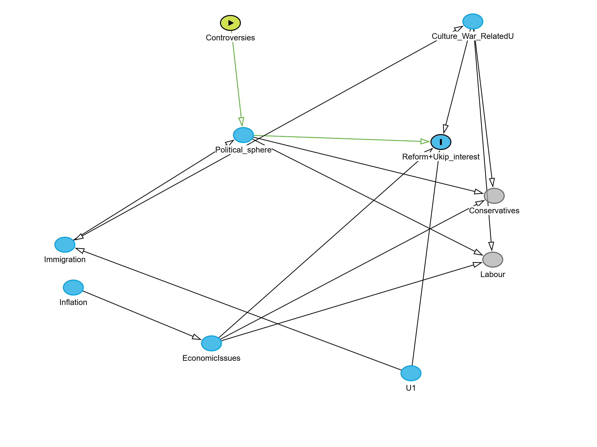

import the data and use janitor to clean names

```{r}
#|warnning: false
#|message: false
library(tidyverse)
library(readxl)
library(tseries)
library(tidyverse)
library(lubridate)
library(strucchange)
library(lavaan)
library(readr)
library(modelsummary)
# Load time_series_GB_20040101_0000_20260422_0807 data
time_series_GB_20040101_0000_20260422_0807 <- read_csv("c:/Users/User/Downloads/time_series_GB_20040101-0000_20260422-0807.csv")
data_clean <- time_series_GB_20040101_0000_20260422_0807 %>%
  mutate(Time = ymd(Time))
data_clean = janitor::clean_names(data_clean)
data_clean$reform_uk = time_series_GB_20040101_0000_20260422_0807$`Reform UK`+time_series_GB_20040101_0000_20260422_0807$`UK Independence Party`
#Combine Reform and UKip topics since reform wasn't founded until later on  to create a composite populist right indicator
```

do a preliminary structural break check on the immigration time series, we are going to be using pre defined dates though

```{r}
summary(strucchange::breakpoints(data_clean$immigration~1))
```

define break dummies using known immigration related topics such as brexit referendum

```{r}
data_clean <- data_clean %>% 
  mutate(break2019 = ifelse(time > as.Date("2019-04-01"), 1, 0), # Reform UK founded small boatscrisis# 
         break2015= ifelse(time>as.Date("2015-05-01"),1,0),    #Brexit #
         break2012= ifelse(time>as.Date("2012-01-01"),1,0))  # Hostile Enviroment Policy# 
```

pre define immigration and inflation break coefs

```{r}
data_clean = data_clean %>% mutate(Refbreakim = immigration*break2019,
Brexitbreakim = immigration*break2015,
Hostilebreakim = immigration*break2012)
data_clean = data_clean %>% mutate(Refbreakinf = inflation*break2019,
Brexitbreakinf = inflation*break2015,
Hostilebreakinf = inflation*break2012)
```

define simple independent ols models and check autocorrelations of residuals

```{r}
library(sandwich)
library(lmtest)
breakmodel1im = lm(reform_uk~break2019+break2015+break2012+immigration+Refbreakim+Brexitbreakim+Hostilebreakim,data=data_clean)
acf(breakmodel1im$residuals)
breakmodel2im = lm(conservative_party~break2019+break2015+break2012+immigration+Refbreakim+Brexitbreakim+Hostilebreakim,data=data_clean)
acf(breakmodel2im$residuals)
breakmodel3im = lm(labour_party~break2019+break2015+break2012+immigration+Refbreakim+Brexitbreakim+Hostilebreakim,data=data_clean)
acf(breakmodel3im$residuals)
breakmodel4im = lm(liberal_democrats~break2019+break2015+break2012+immigration+Refbreakim+Brexitbreakim+Hostilebreakim,data=data_clean)
acf(breakmodel4im$residuals)
```

the DAG at hand visualizing set of conditional independence relations can be visualised this way:

/{width="733"}

define a Seemingly Unrelated Regressions model structure

```{r}
sur_model_imm = '
#Outcome Regressions with breakpoints#

reform_uk~break2019+break2015+break2012+ b1r*immigration + b2r*Refbreakim + b3r*Brexitbreakim + b4r*Hostilebreakim
conservative_party~break2019+break2015+break2012 + b1c*immigration + b2c*Refbreakim + b3c*Brexitbreakim + b4c*Hostilebreakim
labour_party~break2019+break2015+break2012 + b1l*immigration + b2l*Refbreakim + b3l*Brexitbreakim+ b4l*Hostilebreakim
liberal_democrats~break2019+break2015+break2012 + b1d*immigration + b2d*Refbreakim + b3d*Brexitbreakim + b4d*Hostilebreakim
#The Covariance Structure of the Seemingly Unrelated Regressions#

reform_uk~~conservative_party+labour_party+liberal_democrats
conservative_party~~labour_party+liberal_democrats
labour_party~~liberal_democrats

#Contrasts#
diff_ref_con_pre := b1r-b1c
diff_ref_main_pre := (b1r-b1c)-(b1c-b1l)
diff_ref_con := (b2r+b3r+b4r)-(b2c+b3c+b4c) #How much larger are slopes after breaks between Reform and Conservatives 
diff_con_lab := (b2c+b3c+b4c)-(b2l+b3l+b4l) # How much larger are slopes between Conservatives and Labour
diff_lab_lib := (b2l+b3l+b4l)-(b2d+b3d+b4d) # Between Labour and Lib Dem 
diff_con_lib := (b2c+b3c+b4c)-(b2d+b3d+b4d) # Between Conservatives and Lib dems 
diff_ref_main := ((b2r+b3r+b4r)-(b2c+b3c+b4c))-(((b2c+b3c+b4c)-(b2l+b3l+b4l))) # How different is the gap between reform and conservatives compared to conservatives and labour
PseudoDIDrefcon := ((b2r+b3r+b4r)-(b2c+b3c+b4c))-(b1r-b1c)
PseudoDIDrefmain := ((b2r+b3r+b4r)-(b2c+b3c+b4c))-(((b2c+b3c+b4c)-(b2l+b3l+b4l))) - ((b1r-b1c)-(b1c-b1l))
'
sur_model_inf = '
reform_uk~break2019+break2015+break2012 + b1r*inflation + b2r*Refbreakinf + b3r*Brexitbreakinf + b4r*Hostilebreakim
conservative_party~break2019 + break2015 + break2012 + b1c*inflation + b2c*Refbreakinf + b3c*Brexitbreakinf + b4c*Hostilebreakim
labour_party~break2019+break2015+break2012 + b1l*inflation + b2l*Refbreakinf + b3l*Brexitbreakinf + b4l*Hostilebreakim
liberal_democrats~break2019 + break2015 + break2012 + b1d*inflation + b2d*Refbreakinf + b3d*Brexitbreakinf + b4d*Hostilebreakim
#The Covariance Structure of the Seemingly Unrelated Regressions#

reform_uk~~conservative_party+labour_party+liberal_democrats
conservative_party~~labour_party+liberal_democrats
labour_party~~liberal_democrats

#Contrasts Note that Cumulative effects on the slope are considered primarily#
diff_ref_con_pre := b1r-b1c
diff_ref_main_pre := (b1r-b1c)-(b1c-b1l)
PseudoDIDrefcon := ((b2r+b3r+b4r)-(b2c+b3c+b4c))-(b1r-b1c) # DiD estimate using Conservatives as a mainstream control for reform
PseudoDIDrefmain := ((b2r+b3r+b4r)-(b2c+b3c+b4c))-(((b2c+b3c+b4c)-(b2l+b3l+b4l))) - ((b1r-b1c)-(b1c-b1l)) #DDD estimate difference in slopes between reform and conservatives and conservatives and labour, controls for unobservables affecting all rightwing parties
diff_ref_con := (b2r+b3r+b4r)-(b2c+b3c+b4c) #How much larger are slopes after breaks between Reform and Conservatives 
diff_con_lab := (b2c+b3c+b4c)-(b2l+b3l+b4l) # How much larger are slopes between Conservatives and Labour
diff_lab_lib := (b2l+b3l+b4l)-(b2d+b3d+b4d) # Between Labour and Lib Dem 
diff_con_lib := (b2c+b3c+b4c)-(b2d+b3d+b4d) # Between Conservatives and Lib dems 
diff_ref_main := ((b2r+b3r+b4r)-(b2c+b3c+b4c))-(((b2c+b3c+b4c)-(b2l+b3l+b4l))) # How different is the gap between reform and conservatives compared to conservatives and labour
'
```

fit a SUR, allow to use 12 threads for quicker matrix inversions and bootstrap runs

```{r}
set.seed(123)
fitsurimm = sem(sur_model_imm,data=data_clean,se="bootstrap",ncpus=12,bootstrap=2000,parallel="snow")
fitsurinfl = sem(sur_model_inf,data=data_clean,se="bootstrap",ncpus=12,bootstrap=2000,parallel="snow")
```

summarise results

```{r}
modelsummary::datasummary(reform_uk+conservative_party+immigration+labour_party+liberal_democrats+inflation~mean+sd+median+IQR,data=data_clean,title="Descriptive Stats")
modelsummary::modelsummary(list("Immigration interest"=fitsurimm,
"Inflation Interest"=fitsurinfl), statistic = c("std.error","conf.int"),coef_map=c(
  "diff_ref_con := (b2r+b3r+b4r)-(b2c+b3c+b4c)"="Refom vs Conservatives",                                   
 "diff_con_lab := (b2c+b3c+b4c)-(b2l+b3l+b4l)"="Conservatives vs Labour",                                   
 "diff_lab_lib := (b2l+b3l+b4l)-(b2d+b3d+b4d)"="Labour vs Libdems",                                   
 "diff_con_lib := (b2c+b3c+b4c)-(b2d+b3d+b4d)"="Conservatives vs Libdems",                                   
 "diff_ref_main := ((b2r+b3r+b4r)-(b2c+b3c+b4c))-(((b2c+b3c+b4c)-(b2l+b3l+b4l)))"= "Reform Conservative Gap vs Conservative Labour Gap",
"PseudoDIDrefcon := ((b2r+b3r+b4r)-(b2c+b3c+b4c))-(b1r-b1c)"="SlopeDiDrefcon=difference_in_slopes(After-Before)",
"PseudoDIDrefmain := ((b2r+b3r+b4r)-(b2c+b3c+b4c))-(((b2c+b3c+b4c)-(b2l+b3l+b4l)))-((b1r-b1c)-(b1c-b1l))"="SlopeDDDrefmain=difference_in_a_difference_of_slopes(After-Before)",
"diff_ref_con_pre := b1r-b1c" = "Difference in slopes pre break",
"diff_ref_main_pre := (b1r-b1c)-(b1c-b1l)"= "Difference in difference pre break Reform-Con - Con-Lab"
),title="How differently did the political shocks affect parties")
modelsummary::modelsummary(list("Immigration interest"=fitsurimm,
"Inflation Interest"=fitsurinfl),statistic = c("std.error","conf.int"),coef_map=c( "reform_uk ~~ conservative_party"="cov(reform,conservatives)",                                               
 "reform_uk ~~ labour_party"="cov(reform,labour)",                                                     
 "reform_uk ~~ liberal_democrats"="cov(reform,libdems)",                                                
"conservative_party ~~ labour_party"="cov(conservatives,labour)",                                            
"conservative_party ~~ liberal_democrats"="cov(conservatives,libdems)",                                       
"labour_party ~~ liberal_democrats"="cov(labour,libdems)",                                             
 "reform_uk ~~ reform_uk"="var(reform)",                                                        
"conservative_party ~~ conservative_party"="var(conservatives)",                                      
"labour_party ~~ labour_party"="var(labour)",                                                  
"liberal_democrats ~~ liberal_democrats"="var(libdems)" 
),title="residual covariances")
```

APPENDIX:Full model summaries

```{r}
summary(fitsurimm,ci=TRUE)
summary(fitsurinfl,ci=TRUE)
```